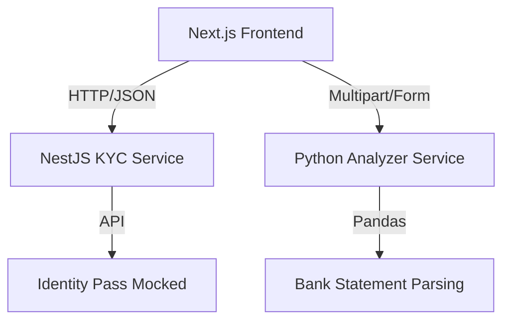

# FlexRent 🏠

A comprehensive PropTech platform for tenant verification and rental management.

---

## 📖 Overview

FlexRent is a microservices-based application designed to bridge the trust gap between landlords and tenants in Nigeria. It automates the vetting process using a polyglot architecture:

- **Identity Verification:** Validates BVN/NIN against government databases.
- **Income Estimation:** Parses bank statements using Python/Pandas data science libraries to determine creditworthiness.
- **Dashboard:** A unified interface for managing rental applications.

---

## 🏗 Architecture

This project is organized as a **monorepo** using Turborepo, allowing for shared configurations and optimized build pipelines across multiple languages.



### Services Breakdown

| Service     | Path                  | Port | Tech Stack                       | Description                                                                     |
| ----------- | --------------------- | ---- | -------------------------------- | ------------------------------------------------------------------------------- |
| Web Client  | apps/web              | 3000 | Next.js (App Router), MUI, React | The main user dashboard and tenant onboarding flow.                             |
| KYC Service | apps/kyc-service      | 3001 | NestJS, TypeScript, Axios        | Handles PII, secure data storage, and calls to 3rd party APIs.                  |
| Analyzer    | apps/analyzer-service | 8000 | Python, FastAPI, Pandas          | Dedicated data science service for parsing PDFs and calculating income metrics. |

---

## 🚀 Getting Started

### Prerequisites

- Node.js (v18+)
- Python (v3.9+)
- pnpm (`npm install -g pnpm`)

### Installation

Clone the repository:

```bash
git clone https://github.com/yourusername/flexrent.git
cd flexrent-workspace
```

Install JavaScript dependencies:

```bash
pnpm install
```

### Setup Python Environment

Navigate to the analyzer service and create a virtual environment:

```bash
cd apps/analyzer-service
python3 -m venv venv
```

Activate the virtual environment:

```bash
# Linux / macOS
source venv/bin/activate

# Windows
venv\Scripts\activate
```

Install Python dependencies:

```bash
pip install -r requirements.txt
```

### Environment Variables

Create a `.env` file in `apps/kyc-service` (use the mock adapter for local development):

```env
NODE_ENV=development
PORT=3001
```

---

## 🏃‍♂️ Running the App

You can start all three services simultaneously from the root directory using Turborepo:

```bash
pnpm dev
```

This will launch:

- Frontend: [http://localhost:3000](http://localhost:3000)
- KYC Backend: [http://localhost:3001](http://localhost:3001)
- Python Analyzer: [http://localhost:8000](http://localhost:8000) (Swagger UI)

---

## 🛠 Features in Development

- [x] Monorepo Setup (Turborepo + pnpm)
- [x] Identity Verification (BVN check via NestJS)
- [x] Income Verification (PDF Upload & Parsing via Python)
- [x] Mock Adapter Pattern (Simulating API calls to save costs during dev)
- [x] User Authentication (NextAuth)
- [ ] Database Integration (PostgreSQL + Prisma)

---

## 🧪 Testing

The KYC service includes a **Mock Adapter** that simulates Nigerian Identity responses without incurring API costs:

- **Success Test:** Use BVN `12345678901`
- **Failure Test:** Use BVN `99999999999`

---

## 🤝 Contributing

This project is a personal portfolio piece demonstrating full-stack proficiency. Feedback is welcome!

Built with ❤️ by Bryan Somto
